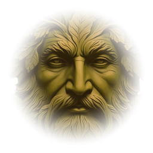

# Folklore Finder Site Style Guide

This guide defines the shared site chrome and page-heading rules. Treat these as implementation requirements, not loose inspiration.

## Canonical Site Chrome

Use the Home page footer brown for every top navigation bar and every footer:

- Bar background: `#1a0e06`
- Piping: a 3px gold/rust line at the top of the nav and a 1px gold/rust divider at the bottom of the nav
- Footer piping: a 1px gold/rust divider at the top of the footer
- Primary text on dark bars: `rgba(242,232,213,0.78)`
- Footer/link text on dark bars: `rgba(246,241,230,.78)` and `rgba(246,241,230,.9)`
- Active nav link: `#c4622a`

**The nav lives in one file: `nav.css`.** Every page that renders `<nav class="topnav">` links it, including the map. Do not copy rules out of it and do not add a page-local `.topnav` rule; the only sanctioned overrides are the two page-scoped ones in `folklorefinder.css` (`.home-page .topnav`, `.interior-page .topnav a`) and the map's, listed under Map Page Exception.

**The footer lives in one file: `footer.css`,** on the same terms. It had twelve copies, seven of them a dead light-on-parchment version that had been overridden for a long time. The sanctioned overrides are `.home-page footer`, `body.night footer` (dusk, on the map) and the map's own, which win on source order because `footer.css` is linked before each page's inline `<style>`.

## Top Navigation

Every page except the Home page must show the brand lockup at the far left:

```html
<a class="topnav-brand" href="./" aria-label="Folklore Finder home">
  
  <span class="topnav-title">Folklore Finder</span>
</a>
```

Use root-relative paths on root-hosted absolute pages such as `404.html`:

```html
<a class="topnav-brand" href="/" aria-label="Folklore Finder home">
  
  <span class="topnav-title">Folklore Finder</span>
</a>
```

Brand lockup rules:

- Logo size: `40px` by `40px`
- Logo-title gap: `11px`
- Brand title font: `Marcellus`
- Brand title size: `clamp(18px, 2.1vw, 23px)`
- Brand title weight: `400`
- Brand title letter spacing: `0.055em`
- Do not add decorative stars/glyphs before or after the nav title.

Nav links:

- Font: `Marcellus`
- Size: `12px`
- Letter spacing: `.08em`
- Text transform: uppercase
- Padding: `6px 14px`
- Border radius: `3px`

Mobile nav:

- At `max-width: 640px`, keep the top nav as one horizontal row.
- Use `flex-wrap: nowrap`, `overflow-x: auto`, and `scrollbar-width: none`.
- Each nav link should use `flex: 0 0 auto` and `white-space: nowrap`.
- Do not wrap the nav links onto multiple rows on mobile.

The Home page keeps its current nav without the brand lockup because the full Folklore Finder title and logo are already the hero identity.

## Map Page Exception

The Map page must match the same nav color, title/logo sizing, nav link styling, and footer styling as the rest of the site.

Allowed differences, and these are the only ones:

- The day and dusk toggle remains in the top-right header controls.
- The map's `<header>` carries `class="topnav"` and takes its bar, piping and link styling from
  `nav.css` like every other page. Three declarations stay map-specific, in `header.topnav`:
  `gap: 10px` (the header is three columns, not a centred link row), `z-index: 1000` (the map
  stacking ladder puts `.sidebar` at 1500 and `.search-results` at 2000 above it, so the canonical
  7500 would cover them), and a `transition` for the dusk fade.
- The map keeps its own responsive breakpoints at 1100px and 860px, where the rest of the site uses
  1200px and 640px. `nav.css` is linked before the inline `<style>`, so the map's rules win.
- The map does not carry the `nav-search` component: it already has an equivalent search that
  navigates to legend pages, and two search fields in one header would be a regression.

Not allowed:

- Do not show the subtitle `An atlas of myths, legends, & stories` in the Map page header.
- Do not use a different bottom banner color.
- Do not put map attribution or bug-report buttons in the site footer. Map attribution should live with the map controls.

## Footer

Every public page footer must use this exact content and link set:

```html
<footer>Folklore Finder &nbsp;&#183;&nbsp; An atlas of myths, legends, &amp; stories &nbsp;&#183;&nbsp; &copy; EditionTree &nbsp;&#183;&nbsp; <a href="https://folklorefinder.uk/about">About</a> &nbsp;&#183;&nbsp; <a href="https://folklorefinder.uk/updates">Updates</a> &nbsp;&#183;&nbsp; <a href="https://ko-fi.com/folklorefinder" target="_blank" rel="noopener">Ko-fi</a> &nbsp;&#183;&nbsp; <a href="https://folklorefinder.uk/privacy">Privacy</a></footer>
```

Do not add a Home link. Do not remove About or Updates. Do not add a coffee icon before Ko-fi.

## Interior Page Headings

Interior page hero headings such as About, My Archive, Privacy, Achievements, and What's New should use the same scale:

```css
font-family: 'Marcellus', serif;
font-size: clamp(42px, 6vw, 74px);
font-weight: 400;
line-height: .98;
letter-spacing: .025em;
```

Do not make the What's New heading smaller than the other interior page headings.

## Generated Pages

The nav is no longer part of this list: change `nav.css` once and every page follows. For other
shared chrome, update all relevant sources:

- `folklorefinder.css` for root static pages
- `legend-page.css` for individual legend pages
- `generate_pages.py` for generated browse, collection, period, region, and legend output
- `map.html` for the interactive map's embedded header/footer styles

After changes to generated page chrome, run `python generate_pages.py` so generated HTML is refreshed.

## Design System

Measured against the codebase on 2026-08-23. Every number below was counted, not estimated, so it
can be recounted later to see whether the gap is closing.

### The decision rule

**When two copies of a style disagree, `folklorefinder.css` wins.** Its `--ff-*` tokens are the
canonical values. Everything else is either an alias or drift.

This is the rule the four-way nav merge needs. The three `.topnav` copies differ in roughly 28
declarations, and the question "which one is right" has blocked that merge. The answer is
`folklorefinder.css`, unless a difference is a deliberate response to context, of which there is
exactly one: the map's day and dusk toggle.

### Colour

Nine colours are already byte-identical across `folklorefinder.css` and `legend-page.css`. The
palette is sound. What is not sound is that each colour answers to two or three names.

| Value | Canonical token | Also called | Role |
|---|---|---|---|
| `#f6f1e6` | `--ff-parchment` | `--parchment`, `--paper` | Page ground |
| `#efe4cf` | `--ff-aged-paper` | `--parchment-dk`, `--paper-deep` | Recessed panels, cards |
| `#3f3023` | `--ff-ink` | `--ink` | Body text |
| `#5a4632` | `--ff-oak-brown` | `--ink-light`, `--ink-soft`, `--muted` | Secondary text |
| `#c4622a` | `--ff-burnt-orange` | `--accent`, `--accent-warm`, `--rust` | Accent, links, primary buttons |
| `#9d461f` | `--ff-burnt-orange-dark` | `--rust-dark` | Accent hover, home-page primary |
| `#b09060` | `--ff-antique-gold` | `--gold`, `--line` | Rules, borders, piping |
| `#66735a` | `--ff-sage-green` | `--sage` | Reserved, 2 uses |
| `#53667a` | `--ff-slate-blue` | `--slate` | Reserved, 1 use |
| `#1a0e06` | `--ff-bar-brown` | `--dark` (on 5 pages) | Nav and footer bars |
| `#1d1712` | `--ff-night` | `--dark` (in `folklorefinder.css`) | Deep ground |
| `#17130f` | none | `--night` (`legend-page.css` only) | Deep ground, legend pages |

Three rules follow from that table:

1. **`--accent` and `--accent-warm` are the same colour.** Pick `--accent`. `--accent-warm` implies
   a warm variant that does not exist.
2. **`#b09060` is called `--gold` in one file and `--line` in another.** One is a colour name, the
   other a role. Use `--ff-antique-gold` and let the role live in the property.
3. **Three near-identical darks is two too many.** `#1d1712`, `#17130f` and `#1a0e06` sit within 13
   to 24 channel steps of each other, which no reader will ever distinguish. Keep `#1a0e06` for
   bars, because the Canonical Site Chrome section above already fixes it as the chrome colour, and
   collapse the other two onto `--ff-night`.

**`--dark` means two different colours depending on the page.** It is `#1d1712` in
`folklorefinder.css` and `#1a0e06` on five pages. Retire the name.

#### The legacy palette is still in the building

An older palette preceded the current one and still appears as hardcoded literals:

| Legacy value | Uses | Superseded by |
|---|---|---|
| `#f2e8d5` | 38 | `#f6f1e6` |
| `#8b3a1a` | 18 | `#c4622a` |
| `#5c4a2a` | 8 | `#5a4632` |
| `#2c1f0e` | 6 | `#3f3023` |
| `#e0d0b0` | 3 | `#efe4cf` |

Across the parchment pages there are 210 hardcoded hex literals outside `:root` blocks. 73 are
legacy values, 97 are one-off colours in neither palette, and 40 are palette colours written out by
hand instead of referenced as a token.

Four pages also carry a local `:root` that redefines the shared tokens with legacy values:
`index.html`, `about.html`, `updates.html` and `archive.html`. **Those blocks are dead code.** On
all four, `folklorefinder.css` is linked after the inline `<style>`, so the shared values win on
source order. They are still worth deleting, because anyone reading `index.html` will believe
`--parchment` is `#f2e8d5`, and moving that one `<link>` earlier would silently repaint the site.

`achievements.html` is the exception: its `<link>` comes first, so its local block wins. Its values
already match the canonical palette, so nothing renders wrongly today.

`editorial.html`, `privacy.html` and `404.html` define no local tokens and are the model to copy.

#### Dusk and parchment are not yet one system

The roadmap asks that dusk and parchment read as two expressions of one system. They currently do
not, and this is the largest gap in the visual identity.

Dusk exists only on the map, as `body.night` inside `map.html`. It is a cool navy scheme built from
26 distinct hex values written as 51 literals across 26 rules, with no tokens at all. Exactly one
of those 26 values also appears in the parchment palette, and that looks incidental.

Parchment is warm: paper, oak, rust, gold. Dusk is `#141e30`, `#2e4870`, `#58739c`, `#c8d8f0`. They
share no hue relationship, so dusk reads as a different product rather than the same map at night.

Making them one system means deriving dusk from the parchment palette rather than replacing it:
keep rust as the accent so an active filter looks the same in both, and let the ground move to
`--ff-night` with gold cooled rather than swapped for blue. That is an art decision, not a
mechanical one, so it needs the same review the category glyphs got.

Whatever is decided, dusk needs tokens before it can be reasoned about at all. 51 literals in one
inline block cannot be kept in step with anything.

### Typography

Two faces, correctly and consistently chosen:

- **Marcellus** for display, headings, buttons, labels and eyebrows. 133 declarations.
- **Spectral** for body text. 32 declarations.

`--font-display` and `--font-body` already exist, but only inside `map.html`, which is the one file
that does not load the shared stylesheet. Move both into `folklorefinder.css` and use them.

#### Type scale

There is no scale. 39 distinct pixel sizes are in use across 353 declarations, including ten
half-pixel sizes accounting for 53 declarations. Half-pixel type is the signature of tuning one
component at a time.

The scale below was derived from what the site already uses rather than imposed. 63 percent of
declarations in the UI range already sit on it exactly, and nothing moves by more than 2px:

`10, 11, 12, 13, 15, 17, 20, 24, 28`

- **10 to 11** uppercase eyebrows, kickers, counters, meta lines
- **12 to 13** buttons, nav links, captions, card meta
- **15 to 17** body text and card body copy
- **20 to 24** card headings and section headings
- **28** page subheadings

Display type above 28px is set with `clamp()` per hero and is left free. Nine declarations sit
there and they are one-offs by nature.

#### Letter-spacing

31 distinct values are in use. Uppercase labels alone use at least five. Three steps cover every
real case:

- `.06em` buttons and nav links
- `.1em` uppercase eyebrows and kickers
- `.16em` the widest tracking, for the small caps above a page hero

Lowercase running text takes no tracking.

### Geometry

15 distinct `border-radius` values are in use. The site's character is square and printed, so the
default is `0` and the exceptions should be few:

- `0` default, and the correct answer for buttons, nav and cards
- `3px` inputs and small chips
- `6px` panels that need to lift off the page, such as the Ko-fi card
- `50%` circular marks only

`2px`, `4px` and `8px` are drift and should snap to the nearest value above. `999px` appears twice
and belongs to pill chips, which is a component the system does not otherwise have.

Borders are `1px solid var(--ff-antique-gold)` at full strength, or `var(--ff-line)`
(`rgba(90,70,50,0.24)`) where the rule should recede. Gold piping on dark bars is fixed by the
Canonical Site Chrome section above and is not open for reinterpretation.

### Buttons

`.btn` is defined from scratch in five separate pages, and they disagree:

| Source | `.btn` tracking | `.btn-primary` background | Primary hover | Primary text |
|---|---|---|---|---|
| `index.html` | `.07em` | `var(--accent-warm)` | `#a84d1e` | `#f2e8d5` |
| `about.html` | `.07em` | `var(--accent-warm)` | `#a84d1e` | `#f2e8d5` |
| `archive.html` | `.06em` | `var(--accent-warm)` | `#a84d1e` | `#f2e8d5` |
| `achievements.html` | `.06em` | `var(--rust)` | `#a84d1e` | `#fff8ec` |
| `404.html` | `.06em` | `#8b3a1a` | `#a8472a` | `#f2e8d5` |
| `folklorefinder.css` (`.home-page`) | inherited | `--ff-burnt-orange-dark` | `#843818` | inherited |

Three hover colours, two text colours, two tracking values, and a primary button on the 404 page
painted in the legacy accent. None of `#a84d1e`, `#a8472a`, `#843818`, `#f2e8d5` or `#fff8ec` is a
palette token.

The canonical button:

- Marcellus, 13px, `.06em`, uppercase, `border-radius: 0`, `1px solid` border
- **Primary** background and border `--ff-burnt-orange`, text `--ff-parchment`, hover
  `--ff-burnt-orange-dark`
- **Secondary** transparent background, border `--ff-antique-gold`, text `--ff-burnt-orange`, hover
  border `--ff-burnt-orange`
- The home page keeps its darker primary, because it sits on artwork rather than parchment. That is
  the one deliberate exception.

Define it once in `folklorefinder.css` and delete the five copies.

### Cards, labels and dividers

**Cards** should sit on `--ff-aged-paper` over the parchment ground, with a `1px` `--ff-line`
border and square corners. A card that needs to lift off the page takes `6px` radius and a gold
border, which is what `.kofi-card` already does (`border: 1px solid var(--gold)`,
`border-radius: 6px`). Card styling has not been audited against this the way buttons and section
labels have, so treat it as the target rather than a description of the current state.

**Section labels** use the `.section-rule` pattern: a horizontal gold rule with the label knocked
out in the middle, Marcellus, 13px, `.1em`, uppercase. This is the site's most distinctive recurring
device and it should be the default way to open a section.

It is also duplicated. `about.html`, `updates.html` and `archive.html` each define it identically
apart from `margin-bottom`, which is `22px` on two of them and `8px` on the third. Move the shared
rule into `folklorefinder.css` and keep only the spacing override.

The home page runs a deliberate variant: `.home-page .section-rule` is left-aligned, sets the label
at 12px with `.14em`, and replaces the left-hand gradient rule with a 104 by 42 oak ornament. That
one is a design decision worth keeping, not drift.

**Eyebrows** sit above a heading in Marcellus, 10 to 11px, `.16em`, uppercase, in
`--ff-burnt-orange`.

**Botanical dividers** are the oak motifs in `assets/ornaments/`. `.ff-divider` centres one between
sections at `3rem` margin and `0.68` opacity; `.ff-leaf-cap` sets a 68 by 28 oak divider beside a
heading at `0.56` opacity. Both are decorative, so they carry no text and stay out of the
accessibility tree. Use them to close a long reading section, not to separate every block. Their
scarcity is what makes them read as ornament rather than furniture.

### Where the gap is, in numbers

Recount these to measure progress:

| Measure | 2026-08-23 |
|---|---|
| Token names meaning different things on different pages | 10 |
| Hardcoded hex literals outside `:root` | 210 |
| Of those, legacy-palette values | 73 |
| Distinct font sizes | 39 |
| Distinct `border-radius` values | 15 |
| Distinct `letter-spacing` values | 31 |
| Pages defining their own `.btn` | 5 |
| Pages defining their own `.section-rule` | 3, plus one deliberate home-page variant |
| Dusk-mode colours defined as tokens | 0 of 26 |
